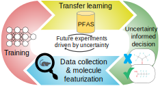

# AI for PFAS
</img>

A replication of the work by Feinstein, Jeremy and Sivaraman, Ganesh and Picel, Kurt and Peters, Brian and Vázquez-Mayagoitia, Álvaro and Ramanathan, Arvind and MacDonell, Margaret and Foster, Ian and Yan, Eugene. 'A deep learning expedition into PFAS toxicity'. The manuscript can be accessed [here](https://pubs.acs.org/doi/10.1021/acs.jcim.1c01204).

##### Contents
 1. [Brief](#brief)
 1. [Context](#context)
 2. [Dataset](#dataset)
 3. [Installation](#installation)

## Summary
This repository contains the code and data used for replication of the study by Feinstein et al, 2021. It also contains the code for the further work to improve on the authors' code.

##### Repository structure
~~~
ai4pfas/
+-- data/
¦   +-- benchmark-models/
¦   +-- deep-ensemble/
¦   ¦   +-- base-models
¦   ¦   +-- calibration
¦   ¦   +-- transfer-models
¦   +-- latent-space/
¦   +-- preprocessed/
¦   ¦   +-- random
¦   ¦   +-- stratified
¦   +-- selective-net/
¦   +-- transfer-learning/
¦   +-- ldtoxdb-classified.csv
¦   +-- ldtoxdb-mordred.csv
¦   +-- ldtoxdb-raw.csv
¦   +-- pfas8k-classified.csv
¦   +-- pfas8k-mordred.csv
+-- media/
+-- notebooks/
¦   +-- dnn/
¦   +-- gcn/
¦   ¦  +-- 00_process_data.ipynb
¦   ¦  +-- 00_process_data.py
¦   ¦  +-- 00_process_data_duplicates.ipynb
¦   ¦  +-- 02_tanimoto_similarity.ipynb
¦   ¦  +-- 03_boxplots.ipynb
¦   ¦  +-- 03_folds_results.ipynb
¦   ¦  +-- 03_loss_plots.ipynb
¦   ¦  +-- 03_test_results.ipynb
¦   ¦  +-- benchmarks_gcn_output.ipynb
¦   ¦  +-- gcn_classification_final.py
¦   ¦  +-- gcn_classification_final_alltrain.py
¦   ¦  +-- gcn_regression_final.py
¦   ¦  +-- gcn_regression_final_alltrain.py
¦   +-- gp/
¦   +-- rf/
+-- src/
¦   +-- graphnn/
¦   +-- dataset.py
¦   +-- experimental_setup.py
¦   +-- helpers.py
¦   +-- models.py
¦   +-- preprocess_data.py
+-- LICENSE
+-- README.md
+-- environment.yml
~~~

## Context
The replication was completed as part of a task in a course project within the Master of Applied Data Science at the University of Gothenburg, Sweden.
## Dataset
LDToxDB was created by compiling LD50 datasets from the [EPA Toxicity Estimation Software Tool (TEST)](https://www.epa.gov/chemical-research/toxicity-estimation-software-tool-test), [NIH Collaborative Acute Toxicity Modeling Suite (CATMoS)](https://ntp.niehs.nih.gov/iccvamreport/2019/technology/comp-tools-dev/catmos/index.html), and National Toxicology Program (NTP). Values represent experimental LD50 measurements in -log(mol/kg). Chemical duplicates were identified by InChIKey and removed.

## Installation
### Requirements
The workflow requires Python 3.11 and relevant packages. Install Anaconda and run the following terminal commands to create an environment based on the repository requirements:
~~~
(base) $ conda create -n ai4pfas -f environment.yml
(base) $ conda activate ai4pfas
~~~

### How to cite the original authors?
If you are using the AI4PFAS workflow in your research, please cite us as
```
@article{doi:10.1021/acs.jcim.1c01204,
author = {Feinstein, Jeremy and Sivaraman, Ganesh and Picel, Kurt and Peters, Brian and Vázquez-Mayagoitia, Álvaro and Ramanathan, Arvind and MacDonell, Margaret and Foster, Ian and Yan, Eugene},
title = {Uncertainty-Informed Deep Transfer Learning of Perfluoroalkyl and Polyfluoroalkyl Substance Toxicity},
journal = {Journal of Chemical Information and Modeling},
doi = {10.1021/acs.jcim.1c01204},
note = {PMID: 34905348},
URL = { 
        https://doi.org/10.1021/acs.jcim.1c01204
},
eprint = { 
        https://doi.org/10.1021/acs.jcim.1c01204
}
}
```
